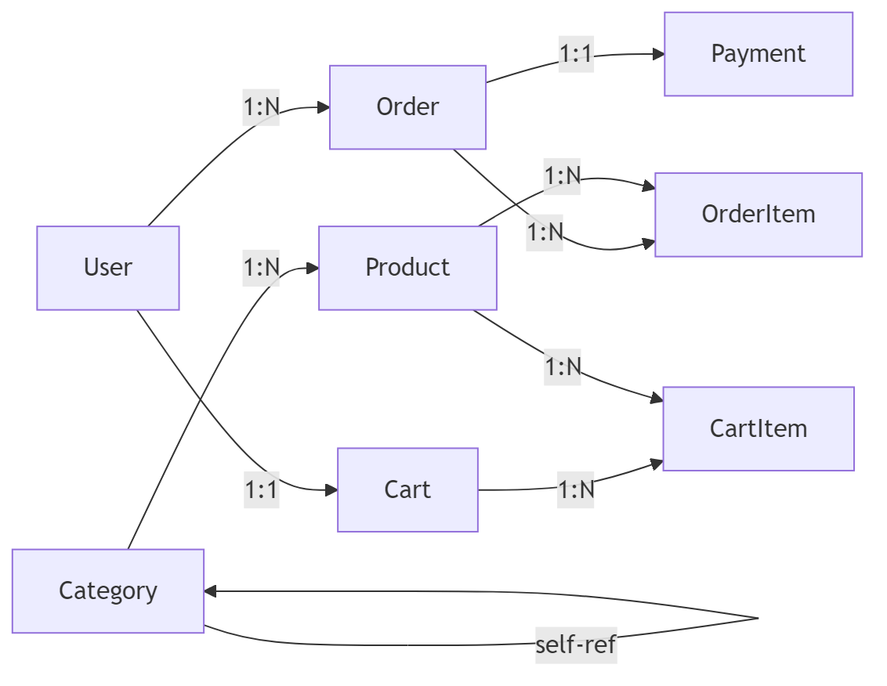

# Sample E-Commerce Database Schema

## Overview

This database supports an e-commerce platform where users can browse products, place orders, and manage payments.

The system is designed to handle high read traffic for product browsing and consistent writes for order processing.

---

# Architecture

## Core Entities

The system contains the following primary entities:

* **User**
* **Product**
* **Category**
* **Order**
* **OrderItem**
* **Payment**
* **Cart**
* **CartItem**

Each entity is stored as a relational table.

---

## User Table

Stores registered user information.

Fields:

* `user_id` (PK)
* `name`
* `email` (unique)
* `password_hash`
* `created_at`

A user can place multiple orders.

---

## Product Table

Stores product details.

Fields:

* `product_id` (PK)
* `name`
* `description`
* `price`
* `stock_quantity`
* `category_id` (FK)

Each product belongs to one category.

---

## Category Table

Defines product categories.

Fields:

* `category_id` (PK)
* `name`
* `parent_category_id` (FK, nullable)

Supports hierarchical categories.

---

## Cart and CartItem

### Cart

* `cart_id` (PK)
* `user_id` (FK)
* `created_at`

Each user has one active cart.

### CartItem

* `cart_item_id` (PK)
* `cart_id` (FK)
* `product_id` (FK)
* `quantity`

Represents items in a cart.

---

## Order and OrderItem

### Order

* `order_id` (PK)
* `user_id` (FK)
* `total_amount`
* `status`
* `created_at`

A user can have multiple orders.

### OrderItem

* `order_item_id` (PK)
* `order_id` (FK)
* `product_id` (FK)
* `quantity`
* `price_at_purchase`

Each order consists of multiple items.

---

## Payment Table

Stores payment information.

Fields:

* `payment_id` (PK)
* `order_id` (FK)
* `payment_method`
* `status`
* `transaction_id`
* `paid_at`

Each order has one payment record.

---

## Relationships

* User → Order (1:N)
* User → Cart (1:1)
* Cart → CartItem (1:N)
* Product → CartItem (1:N)
* Order → OrderItem (1:N)
* Product → OrderItem (1:N)
* Category → Product (1:N)
* Category → Category (self-referencing hierarchy)
* Order → Payment (1:1)

---

## Data Flow

1. User browses products by category
2. User adds products to cart
3. Cart stores selected items
4. User places an order
5. OrderItems are created from CartItems
6. Payment is processed
7. Order status is updated

---

## Constraints and Rules

* Email must be unique per user
* Product stock must be >= 0
* Order cannot exist without at least one OrderItem
* Payment must be associated with a valid Order
* Cart is cleared after successful order placement

---

## Indexing Strategy

* Index on `user.email`
* Index on `product.category_id`
* Index on `order.user_id`
* Composite index on `order_item.order_id, product_id`

---

## Why this is a good test file

This README lets you test:

* ER diagram generation (strong signal)
* entity extraction from structured text
* relationship inference (1:N, 1:1, self-referencing)
* handling hierarchical relationships (Category)
* filtering noise (ignore indexing / constraints sections)

---

## What a good diagram should capture

Minimum:

* entities as nodes
* relationships as edges
* direction + cardinality (if possible)

Example expectations:

* User → Order
* Order → OrderItem
* Product → OrderItem
* Category → Product
* Category → Category (self-loop)
